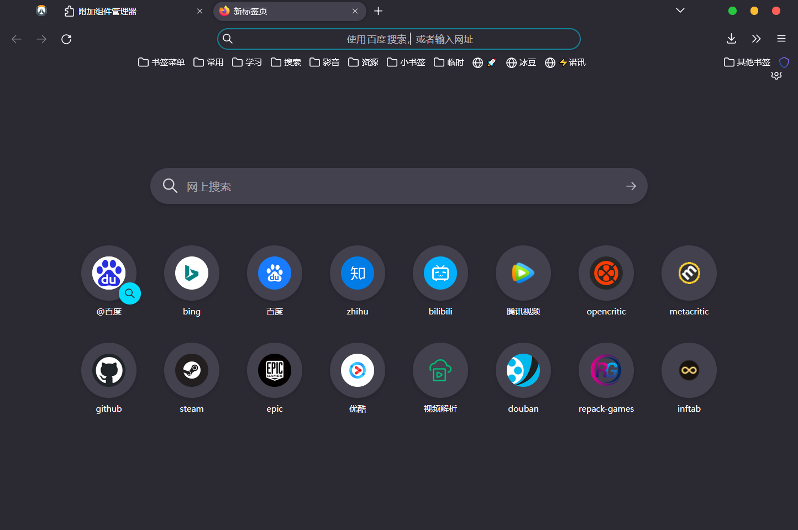
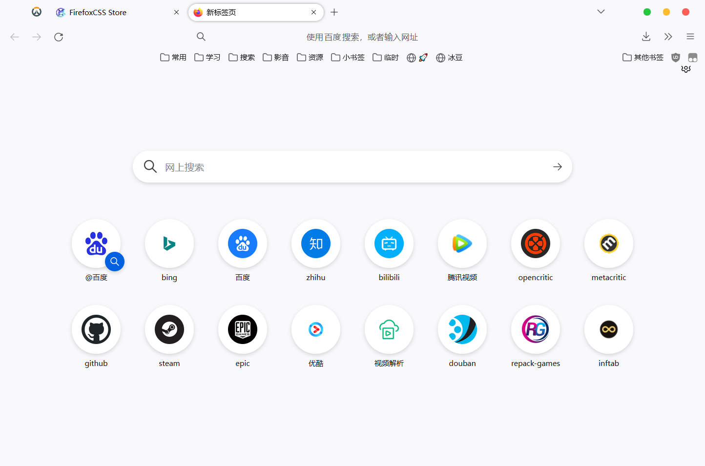
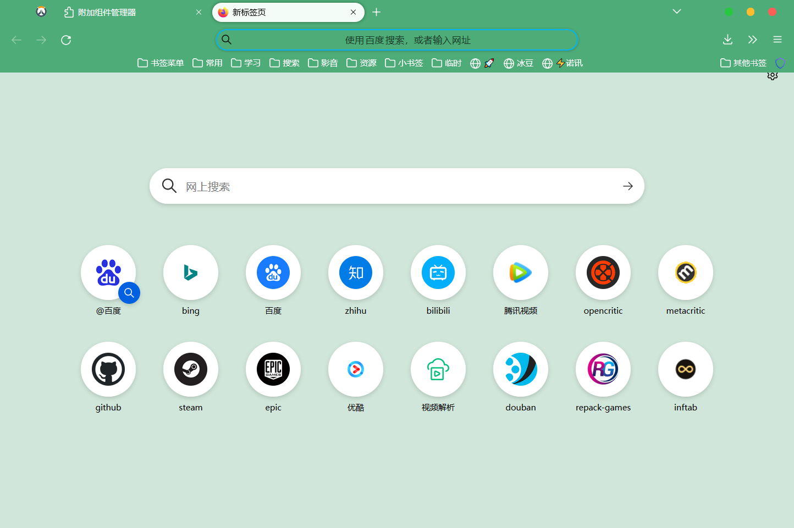

# TYHfox
## 用法

>1 在 Firefox 的地址栏访问 `about:config`,搜索 `toolkit.legacyUserProfileCustomizations.stylesheets`
设置为 true
>
>2 在 Firefox 的地址栏访问 `about:support`,选择下方的 Profile Folder,点击 Open Folder。
>
>3 创建一个chrome 的文件夹,将 userChrome.css,usercontent.css 文件和TYH文件夹放入chrome文件夹
>
>4 打开 Firefox,firefox变成图片中样式
>
## [css下载](https://github.com/tyuhao/TYHfox)

|  dark   | light  | green  |
|  ----  | ----  |----  |
|   |  | |
